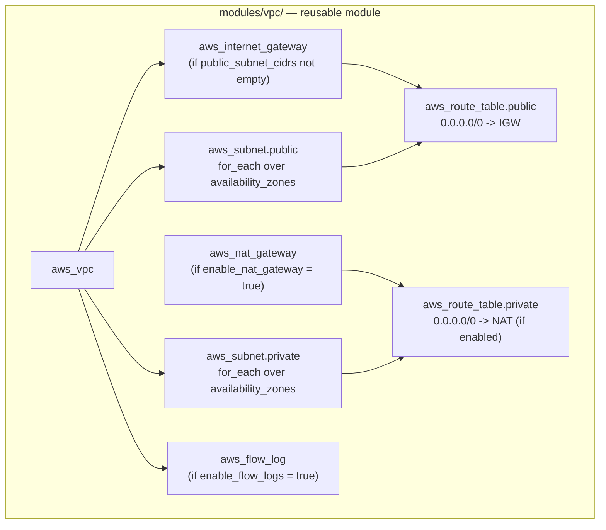
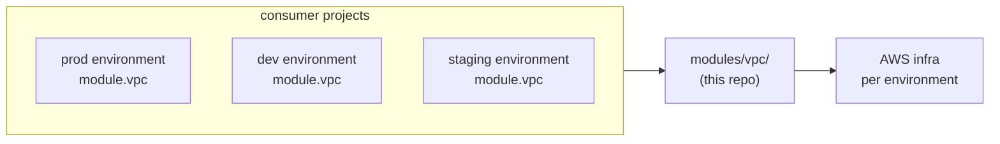

# Architecture

## Module composition



## How callers consume it



Each caller gets the same module behavior with different inputs (name, CIDR, AZs, optional NAT). The terraform state for each caller is independent — the module is stateless.

## Design decisions

### `for_each` over `count`

`count` indexes resources by position (`aws_subnet.public[0]`, `[1]`, ...). Removing the first AZ from the input list causes terraform to destroy `[0]` and rename `[1]` to `[0]` — recreating subnets that didn't logically change.

`for_each` indexes by stable key (the AZ name). Removing one AZ only removes that AZ's subnet; the others are untouched. This is the right pattern for any resource keyed by a stable identifier.

### Guarded `zipmap` against empty subnet lists

The locals block originally did `zipmap(var.availability_zones, var.private_subnet_cidrs)` unconditionally. If `private_subnet_cidrs = []` (the default) and `availability_zones` has entries, `zipmap` fails:

```
Call to function "zipmap" failed: number of keys (2) does not match number of values (0).
```

The fix wraps each zipmap in a length check:

```hcl
private_subnets = length(var.private_subnet_cidrs) > 0 ? zipmap(var.availability_zones, var.private_subnet_cidrs) : {}
```

This matches the existing guard pattern already used at line 95 for the NAT gateway.

### Optional NAT Gateway (off by default)

NAT Gateway costs ~$32/month + per-GB processing fees. Dev environments often don't need private subnet outbound egress (no patching, no external API calls). Defaulting to `enable_nat_gateway = false` lets callers save cost where they can without forcing a separate module variant.

### Optional Flow Logs built in

VPC Flow Logs are usually deployed as a separate observability concern. Including them as an optional module flag means observability is a one-line decision at module-call time, not a separate concern bolted on later. The accompanying [aws-network-monitoring](https://github.com/SalamoneJack/aws-network-monitoring) lab consumes the same flow log destination.

## Outputs

| Output | Type | Purpose |
|---|---|---|
| `vpc_id` | string | Single VPC ID for filtering / referencing |
| `vpc_cidr` | string | Caller may need the CIDR for SG references |
| `public_subnet_ids` | map (AZ -> subnet ID) | For services like ALB that need subnet IDs per AZ |
| `private_subnet_ids` | map (AZ -> subnet ID) | For services like RDS subnet groups |
| `internet_gateway_id` | string | Rare but useful for caller-side route additions |
| `nat_gateway_id` | string \| null | Null when `enable_nat_gateway = false` |

The output map keyed by AZ name lets callers do things like `module.vpc.public_subnet_ids["us-east-1a"]` without remembering list positions.
